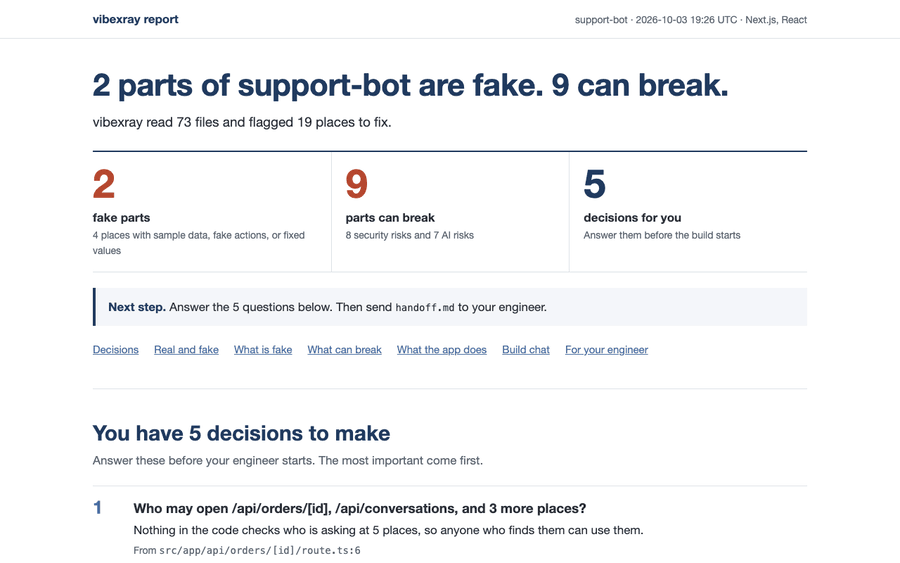

<h1 align="center">vibexray</h1>
<p align="center"><strong>See what is real and what is fake in an AI-built prototype, before the engineer builds it.</strong></p>
<p align="center">A skill for Claude Code and Codex. It reads the prototype, starts it, and writes a report for the PM and a handoff for the engineer. Every finding points to a file and a line.</p>

<p align="center">
  <a href="https://github.com/xmpuspus/vibexray/actions/workflows/ci.yml"></a>
  
  
  <a href="LICENSE"></a>
</p>

<p align="center"></p>

```bash
claude plugin marketplace add xmpuspus/vibexray
claude plugin install vibexray@vibexray
```

Then open your prototype folder in Claude Code and type `/vibexray`. That is the whole loop.

> **Note:** vibexray finds part of what a careful engineer finds, not all of it. The [measured results](#vibexray-finds-about-half-of-the-hand-labeled-problems) say how much. Use the report to start the handoff, not to skip the engineer's review.

## I built this to help product managers help me build their dreams

I am an engineer. I do my best work when the product manager is at the top of their game.

Product managers now build working prototypes with Claude Code and Codex. The prototype looks done. Some parts are real. Some parts show sample data or fake a button. Some parts let any user read any other user's data. The PM cannot tell which is which, and the first engineering meeting turns into a list of surprises.

vibexray tells the PM which is which before the handoff. The PM answers a few decisions, then sends the engineer a handoff that names every file and line.

## The PM gets one page that answers four questions

<p align="center"></p>

The scan writes three files to `vibexray-report/`:

| File | Reader | What it holds |
|---|---|---|
| `report.html` | The PM | What is fake, what can break, what the app does, and the decisions the PM must make |
| `handoff.md` | The engineer and their coding agent | Every finding with its file, line, code, and fix |
| `vibexray.json` | Tools | All findings, parts, questions, and build-chat prompts |

The report answers these questions:

1. **What is fake?** Sample data shown as real, buttons that do nothing, and fixed values that belong in settings.
2. **What can break?** Pages with no login check, open database rules, keys in browser code, and AI risks.
3. **What does the app do?** vibexray starts the app in a copy, visits up to 8 pages, and saves screenshots.
4. **What must the PM decide?** Up to 10 plain questions, such as "Who may open /api/orders/[id]?"

Each file of the prototype gets one label:

- **Keep**: real code. The engineer can build on it.
- **Rewrite**: the idea is real, but the code is not ready.
- **Throw away**: demo only. Remove it before launch.
- **Check**: vibexray is not sure. A person looks at it.

## Install

### Claude Code

```bash
claude plugin marketplace add xmpuspus/vibexray
claude plugin install vibexray@vibexray
```

Inside Claude Code, the same two steps are `/plugin marketplace add xmpuspus/vibexray` and `/plugin install vibexray@vibexray`. Then type `/vibexray` in your prototype folder, or ask "is this ready for engineering?"

### Codex

```bash
codex plugin marketplace add xmpuspus/vibexray
codex plugin add vibexray@vibexray
```

Then ask Codex to "x-ray this prototype". The Codex sandbox blocks local servers by default, so the report says that the app did not start. The code review still runs.

### Let vibexray start the app

The scan needs only Python 3.11 or newer. To start the app and take screenshots, vibexray also needs Node and Playwright:

```bash
python3 -m pip install playwright
python3 -m playwright install chromium
```

Without Playwright, the report says how to add it, and every other section still fills in.

### The command line, with no AI host

```bash
pipx install vibexray
vibexray scan ./my-prototype --open
```

The command line runs the pattern rules, the app run, and the build-chat reader. It does not run the AI review, so it finds fewer problems than the skill.

## How a scan works

1. **Pattern rules.** 71 rules look for known shapes, such as a mock data import. Run `vibexray rules` to list them.
2. **App run.** vibexray copies the prototype to a temporary folder, without your `.env` files. It reuses your installed packages through a copy-on-write clone, or installs them with `--ignore-scripts`. It starts the app, visits its pages, and stops every process it started.
3. **Build chat.** vibexray reads the Claude Code and Codex chats for this folder on this computer. It keeps only the prompts you typed. If you said "refunds over 100 dollars need a manager's approval" and the code has no such check, the report asks about it.
4. **AI review.** The host agent, Claude Code or Codex, reads the code with a fixed checklist and writes `review.json`. Each finding must quote the exact code on the cited line.
5. **Line check.** `vibexray review` opens each cited file and line. It keeps a finding only if the quote is on that line. It drops the others, so an invented finding never reaches the report.

## vibexray finds about half of the hand-labeled problems

The test set holds 23 public prototypes built with AI tools. Reviewers who never saw vibexray labeled 320 problems by file and line. Seven prototypes built with Claude Code or Codex stayed out of all tuning. The table shows the results on those seven.

| Host | Labeled problems found | Findings that match a label | Findings that are real, after an audit |
|---|---|---|---|
| Claude Code | 53% | 54% | 65% |
| Codex | 53% | 66% | 75% |
| Pattern rules only | 6% | 33% | not audited |

- Each number is the mean of 3 runs. The runs differ by 5 points or less.
- The line check dropped 0 of 662 AI findings. The AI cited a real file, line, and quote every time.
- An auditor read the code at all 118 findings that matched no label. 19 showed problems the labelers missed, and 37 were wrong.
- The audit column counts a finding as real only in the labeled category. A looser count gives 73% and 80%.
- The Codex runs loaded the maintainer's own `AGENTS.md`. The Codex sandbox blocked the app run, so Codex read the code only.
- Before the last checklist change, Claude found 51% of the problems on the same seven prototypes. The change used only the other 16.

[tests/corpus/README.md](tests/corpus/README.md) explains how to run the test again.

## What vibexray never does

- It never edits the prototype. The app runs in a temporary copy, and the copy goes when the scan ends.
- It sends no code anywhere itself. The AI review runs in your own Claude Code or Codex session, under that tool's terms.
- It goes online only for the app run, to download packages as `npm install` does. Use `--no-run` to stay offline.
- It never shows a secret. Key-shaped values show as `sk-pro...[hidden]` in every output.
- It never passes your keys to the app. The copy leaves out your `.env` files, and the app starts with `PATH`, a temporary `HOME`, and `PORT` only.
- It never reads another folder's chats. Use `--no-history` to skip the build chat.

## Command reference

```text
vibexray scan PATH [--out DIR] [--no-run] [--no-history] [--open] [--json]
vibexray review REPORT_DIR [--input review.json]
vibexray rules
vibexray --version
```

| Flag | Effect |
|---|---|
| `--out DIR` | Write the three files to `DIR`. The default is `./vibexray-report`. |
| `--no-run` | Do not start the app. |
| `--no-history` | Do not read the build chat. |
| `--open` | Open `report.html` in a browser. |
| `--json` | Print `vibexray.json` to the terminal. |

## Development

```bash
uv venv && uv pip install -e ".[dev]"
uv run playwright install chromium
make corpus   # clone the 23 pinned prototype repos
make lint     # ruff check and ruff format --check
make test     # unit and CLI tests
make e2e      # corpus accuracy, app runs, and browser tests
```

[AGENTS.md](AGENTS.md) lists the repository contracts. [CONTRIBUTING.md](CONTRIBUTING.md) explains how to add a rule.

## License

MIT. See [LICENSE](LICENSE). Changes are in [CHANGELOG.md](CHANGELOG.md).
